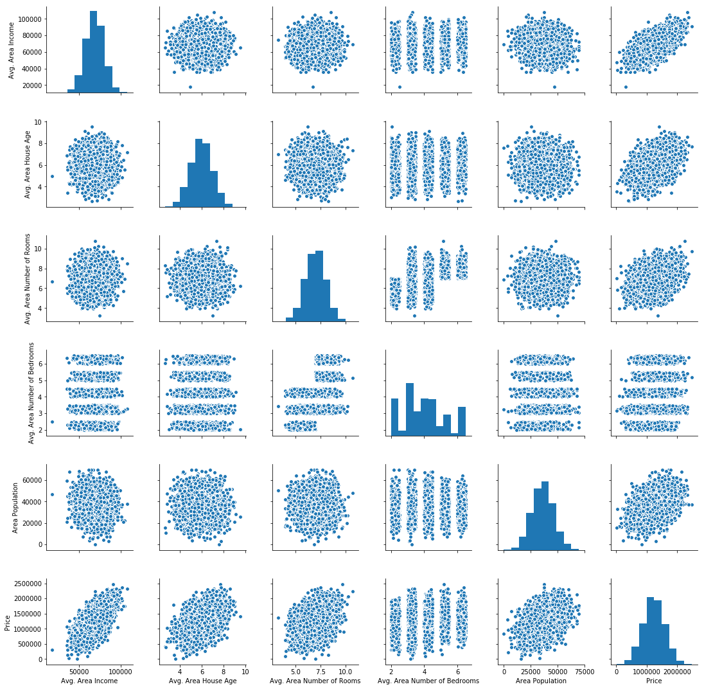
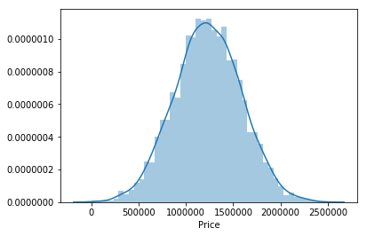
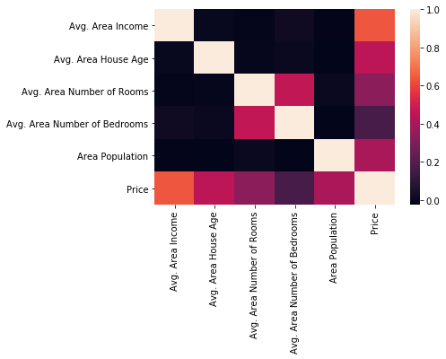
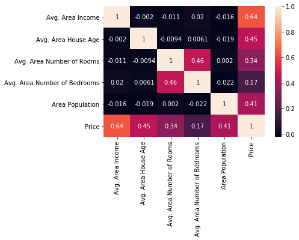
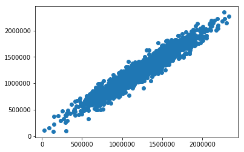
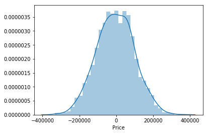

```python
import pandas as pd
import numpy as np
```


```python
import matplotlib.pyplot as plt
import seaborn as sns
```


```python
%matplotlib inline
```


```python
df=pd.read_csv('USA_Housing.csv')
```


```python
df.head()
```


<div>
<style scoped>
    .dataframe tbody tr th:only-of-type {
        vertical-align: middle;
    }

    .dataframe tbody tr th {
        vertical-align: top;
    }

    .dataframe thead th {
        text-align: right;
    }
</style>
<table border="1" class="dataframe">
  <thead>
    <tr style="text-align: right;">
      <th></th>
      <th>Avg. Area Income</th>
      <th>Avg. Area House Age</th>
      <th>Avg. Area Number of Rooms</th>
      <th>Avg. Area Number of Bedrooms</th>
      <th>Area Population</th>
      <th>Price</th>
      <th>Address</th>
    </tr>
  </thead>
  <tbody>
    <tr>
      <th>0</th>
      <td>79545.458574</td>
      <td>5.682861</td>
      <td>7.009188</td>
      <td>4.09</td>
      <td>23086.800503</td>
      <td>1.059034e+06</td>
      <td>208 Michael Ferry Apt. 674\nLaurabury, NE 3701...</td>
    </tr>
    <tr>
      <th>1</th>
      <td>79248.642455</td>
      <td>6.002900</td>
      <td>6.730821</td>
      <td>3.09</td>
      <td>40173.072174</td>
      <td>1.505891e+06</td>
      <td>188 Johnson Views Suite 079\nLake Kathleen, CA...</td>
    </tr>
    <tr>
      <th>2</th>
      <td>61287.067179</td>
      <td>5.865890</td>
      <td>8.512727</td>
      <td>5.13</td>
      <td>36882.159400</td>
      <td>1.058988e+06</td>
      <td>9127 Elizabeth Stravenue\nDanieltown, WI 06482...</td>
    </tr>
    <tr>
      <th>3</th>
      <td>63345.240046</td>
      <td>7.188236</td>
      <td>5.586729</td>
      <td>3.26</td>
      <td>34310.242831</td>
      <td>1.260617e+06</td>
      <td>USS Barnett\nFPO AP 44820</td>
    </tr>
    <tr>
      <th>4</th>
      <td>59982.197226</td>
      <td>5.040555</td>
      <td>7.839388</td>
      <td>4.23</td>
      <td>26354.109472</td>
      <td>6.309435e+05</td>
      <td>USNS Raymond\nFPO AE 09386</td>
    </tr>
  </tbody>
</table>
</div>


```python
df.info()
```

    <class 'pandas.core.frame.DataFrame'>
    RangeIndex: 5000 entries, 0 to 4999
    Data columns (total 7 columns):
    Avg. Area Income                5000 non-null float64
    Avg. Area House Age             5000 non-null float64
    Avg. Area Number of Rooms       5000 non-null float64
    Avg. Area Number of Bedrooms    5000 non-null float64
    Area Population                 5000 non-null float64
    Price                           5000 non-null float64
    Address                         5000 non-null object
    dtypes: float64(6), object(1)
    memory usage: 273.5+ KB


```python
df.describe()
```


<div>
<style scoped>
    .dataframe tbody tr th:only-of-type {
        vertical-align: middle;
    }

    .dataframe tbody tr th {
        vertical-align: top;
    }

    .dataframe thead th {
        text-align: right;
    }
</style>
<table border="1" class="dataframe">
  <thead>
    <tr style="text-align: right;">
      <th></th>
      <th>Avg. Area Income</th>
      <th>Avg. Area House Age</th>
      <th>Avg. Area Number of Rooms</th>
      <th>Avg. Area Number of Bedrooms</th>
      <th>Area Population</th>
      <th>Price</th>
    </tr>
  </thead>
  <tbody>
    <tr>
      <th>count</th>
      <td>5000.000000</td>
      <td>5000.000000</td>
      <td>5000.000000</td>
      <td>5000.000000</td>
      <td>5000.000000</td>
      <td>5.000000e+03</td>
    </tr>
    <tr>
      <th>mean</th>
      <td>68583.108984</td>
      <td>5.977222</td>
      <td>6.987792</td>
      <td>3.981330</td>
      <td>36163.516039</td>
      <td>1.232073e+06</td>
    </tr>
    <tr>
      <th>std</th>
      <td>10657.991214</td>
      <td>0.991456</td>
      <td>1.005833</td>
      <td>1.234137</td>
      <td>9925.650114</td>
      <td>3.531176e+05</td>
    </tr>
    <tr>
      <th>min</th>
      <td>17796.631190</td>
      <td>2.644304</td>
      <td>3.236194</td>
      <td>2.000000</td>
      <td>172.610686</td>
      <td>1.593866e+04</td>
    </tr>
    <tr>
      <th>25%</th>
      <td>61480.562388</td>
      <td>5.322283</td>
      <td>6.299250</td>
      <td>3.140000</td>
      <td>29403.928702</td>
      <td>9.975771e+05</td>
    </tr>
    <tr>
      <th>50%</th>
      <td>68804.286404</td>
      <td>5.970429</td>
      <td>7.002902</td>
      <td>4.050000</td>
      <td>36199.406689</td>
      <td>1.232669e+06</td>
    </tr>
    <tr>
      <th>75%</th>
      <td>75783.338666</td>
      <td>6.650808</td>
      <td>7.665871</td>
      <td>4.490000</td>
      <td>42861.290769</td>
      <td>1.471210e+06</td>
    </tr>
    <tr>
      <th>max</th>
      <td>107701.748378</td>
      <td>9.519088</td>
      <td>10.759588</td>
      <td>6.500000</td>
      <td>69621.713378</td>
      <td>2.469066e+06</td>
    </tr>
  </tbody>
</table>
</div>


```python
df.columns
```


    Index([u'Avg. Area Income', u'Avg. Area House Age',
           u'Avg. Area Number of Rooms', u'Avg. Area Number of Bedrooms',
           u'Area Population', u'Price', u'Address'],
          dtype='object')


```python
sns.pairplot(df)
```


    <seaborn.axisgrid.PairGrid at 0x1a102cccd0>





```python
sns.distplot(df['Price'])
```

    /Users/bourymbodj/anaconda2/lib/python2.7/site-packages/matplotlib/axes/_axes.py:6462: UserWarning: The 'normed' kwarg is deprecated, and has been replaced by the 'density' kwarg.
      warnings.warn("The 'normed' kwarg is deprecated, and has been "


    <matplotlib.axes._subplots.AxesSubplot at 0x1a102e1f10>





```python
df.corr()
```


<div>
<style scoped>
    .dataframe tbody tr th:only-of-type {
        vertical-align: middle;
    }

    .dataframe tbody tr th {
        vertical-align: top;
    }

    .dataframe thead th {
        text-align: right;
    }
</style>
<table border="1" class="dataframe">
  <thead>
    <tr style="text-align: right;">
      <th></th>
      <th>Avg. Area Income</th>
      <th>Avg. Area House Age</th>
      <th>Avg. Area Number of Rooms</th>
      <th>Avg. Area Number of Bedrooms</th>
      <th>Area Population</th>
      <th>Price</th>
    </tr>
  </thead>
  <tbody>
    <tr>
      <th>Avg. Area Income</th>
      <td>1.000000</td>
      <td>-0.002007</td>
      <td>-0.011032</td>
      <td>0.019788</td>
      <td>-0.016234</td>
      <td>0.639734</td>
    </tr>
    <tr>
      <th>Avg. Area House Age</th>
      <td>-0.002007</td>
      <td>1.000000</td>
      <td>-0.009428</td>
      <td>0.006149</td>
      <td>-0.018743</td>
      <td>0.452543</td>
    </tr>
    <tr>
      <th>Avg. Area Number of Rooms</th>
      <td>-0.011032</td>
      <td>-0.009428</td>
      <td>1.000000</td>
      <td>0.462695</td>
      <td>0.002040</td>
      <td>0.335664</td>
    </tr>
    <tr>
      <th>Avg. Area Number of Bedrooms</th>
      <td>0.019788</td>
      <td>0.006149</td>
      <td>0.462695</td>
      <td>1.000000</td>
      <td>-0.022168</td>
      <td>0.171071</td>
    </tr>
    <tr>
      <th>Area Population</th>
      <td>-0.016234</td>
      <td>-0.018743</td>
      <td>0.002040</td>
      <td>-0.022168</td>
      <td>1.000000</td>
      <td>0.408556</td>
    </tr>
    <tr>
      <th>Price</th>
      <td>0.639734</td>
      <td>0.452543</td>
      <td>0.335664</td>
      <td>0.171071</td>
      <td>0.408556</td>
      <td>1.000000</td>
    </tr>
  </tbody>
</table>
</div>


```python
sns.heatmap(df.corr())
```


    <matplotlib.axes._subplots.AxesSubplot at 0x1a116c4bd0>





```python
sns.heatmap(df.corr(),annot=True)
```


    <matplotlib.axes._subplots.AxesSubplot at 0x1a0f927f90>





```python
#We want to predict the price with linear regression
df.columns
```


    Index([u'Avg. Area Income', u'Avg. Area House Age',
           u'Avg. Area Number of Rooms', u'Avg. Area Number of Bedrooms',
           u'Area Population', u'Price', u'Address'],
          dtype='object')


```python
#X represent my features
X= df[['Avg. Area Income', 'Avg. Area House Age',
       'Avg. Area Number of Rooms', 'Avg. Area Number of Bedrooms',
       'Area Population']]
```


```python
#Y represent my target variables 
y= df['Price']
```


```python
#Use scikit learn to split data into training and testing set
from sklearn.model_selection import train_test_split
```


```python
#Try shift + tab then expand by clicking on plus button then copy line 
train_test_split
```


    <function sklearn.model_selection._split.train_test_split>


```python
#Test size is the percentage size you want to be test data
X_train, X_test, y_train, y_test = train_test_split( X, y, test_size=0.4, random_state=101)
```


```python
from sklearn.linear_model import LinearRegression
```


```python
#We instantiate a variable of the linearRegressionModel
lm = LinearRegression()
```


```python
#Using lm. + clicking tab gives us all the available methods
#We use the .fit method that's going to fit our linear model to the best curve 
#In this case we only want to fit our model to our training data
lm.fit(X_train,y_train)
```


    LinearRegression(copy_X=True, fit_intercept=True, n_jobs=1, normalize=False)


```python
#The previous line/ output states that the linear model has been trained
```


```python
#Next step is to evaluate or model by checking out its coefffcients and see how we can interpret them
```


```python
print(lm.intercept_)
```

    -2640159.796851911


```python
lm.coef_
```


    array([2.15282755e+01, 1.64883282e+05, 1.22368678e+05, 2.23380186e+03,
           1.51504200e+01])


```python
# Each of the coefficients relate to the columns of the x train
X_train.columns
```


    Index([u'Avg. Area Income', u'Avg. Area House Age',
           u'Avg. Area Number of Rooms', u'Avg. Area Number of Bedrooms',
           u'Area Population'],
          dtype='object')


```python
#Pass coeffiecients as data, colums as index
cdf= pd.DataFrame(lm.coef_,X.columns, columns=['Coeff'])
```


```python
cdf
```


<div>
<style scoped>
    .dataframe tbody tr th:only-of-type {
        vertical-align: middle;
    }

    .dataframe tbody tr th {
        vertical-align: top;
    }

    .dataframe thead th {
        text-align: right;
    }
</style>
<table border="1" class="dataframe">
  <thead>
    <tr style="text-align: right;">
      <th></th>
      <th>Coeff</th>
    </tr>
  </thead>
  <tbody>
    <tr>
      <th>Avg. Area Income</th>
      <td>21.528276</td>
    </tr>
    <tr>
      <th>Avg. Area House Age</th>
      <td>164883.282027</td>
    </tr>
    <tr>
      <th>Avg. Area Number of Rooms</th>
      <td>122368.678027</td>
    </tr>
    <tr>
      <th>Avg. Area Number of Bedrooms</th>
      <td>2233.801864</td>
    </tr>
    <tr>
      <th>Area Population</th>
      <td>15.150420</td>
    </tr>
  </tbody>
</table>
</div>


```python
# What do these coeffiecients mean if we hold all other feautures fixed
# A one unit increase in average Area income is equal to 21.52 cents increase in price
# A one unit increase in house  the averga area age is equivalent to 164883 increase in price
```


```python
#Another example from real data
```


```python
from sklearn.datasets import load_boston
```


```python
boston= load_boston()
```


```python
#It is  basically a dictionary with information in it 
boston.keys()
```


    ['data', 'feature_names', 'DESCR', 'target']


```python
print(boston['DESCR'])
```

    Boston House Prices dataset
    ===========================
    
    Notes
    ------
    Data Set Characteristics:  
    
        :Number of Instances: 506 
    
        :Number of Attributes: 13 numeric/categorical predictive
        
        :Median Value (attribute 14) is usually the target
    
        :Attribute Information (in order):
            - CRIM     per capita crime rate by town
            - ZN       proportion of residential land zoned for lots over 25,000 sq.ft.
            - INDUS    proportion of non-retail business acres per town
            - CHAS     Charles River dummy variable (= 1 if tract bounds river; 0 otherwise)
            - NOX      nitric oxides concentration (parts per 10 million)
            - RM       average number of rooms per dwelling
            - AGE      proportion of owner-occupied units built prior to 1940
            - DIS      weighted distances to five Boston employment centres
            - RAD      index of accessibility to radial highways
            - TAX      full-value property-tax rate per $10,000
            - PTRATIO  pupil-teacher ratio by town
            - B        1000(Bk - 0.63)^2 where Bk is the proportion of blacks by town
            - LSTAT    % lower status of the population
            - MEDV     Median value of owner-occupied homes in $1000's
    
        :Missing Attribute Values: None
    
        :Creator: Harrison, D. and Rubinfeld, D.L.
    
    This is a copy of UCI ML housing dataset.
    http://archive.ics.uci.edu/ml/datasets/Housing
    
    
    This dataset was taken from the StatLib library which is maintained at Carnegie Mellon University.
    
    The Boston house-price data of Harrison, D. and Rubinfeld, D.L. 'Hedonic
    prices and the demand for clean air', J. Environ. Economics & Management,
    vol.5, 81-102, 1978.   Used in Belsley, Kuh & Welsch, 'Regression diagnostics
    ...', Wiley, 1980.   N.B. Various transformations are used in the table on
    pages 244-261 of the latter.
    
    The Boston house-price data has been used in many machine learning papers that address regression
    problems.   
         
    **References**
    
       - Belsley, Kuh & Welsch, 'Regression diagnostics: Identifying Influential Data and Sources of Collinearity', Wiley, 1980. 244-261.
       - Quinlan,R. (1993). Combining Instance-Based and Model-Based Learning. In Proceedings on the Tenth International Conference of Machine Learning, 236-243, University of Massachusetts, Amherst. Morgan Kaufmann.
       - many more! (see http://archive.ics.uci.edu/ml/datasets/Housing)
    


# Predictions


```python
predictions = lm.predict(X_test)
```


```python
predictions
```


    array([1260960.70567626,  827588.75560352, 1742421.24254328, ...,
            372191.40626952, 1365217.15140895, 1914519.54178824])


```python
#The previous line shows the predicted prices of the house based on the training that we have previously done with lm
```


```python
#The y_test has the correct prices of the houses 
y_test
```


    1718    1.251689e+06
    2511    8.730483e+05
    345     1.696978e+06
    2521    1.063964e+06
    54      9.487883e+05
    2866    7.300436e+05
    2371    1.166925e+06
    2952    7.054441e+05
    45      1.499989e+06
    4653    1.288199e+06
    891     1.441737e+06
    3011    1.279681e+06
    335     1.754969e+06
    3050    1.511653e+06
    3850    1.441956e+06
    834     1.119993e+06
    3188    7.278665e+05
    4675    1.138885e+06
    2564    1.074263e+06
    1866    1.386473e+06
    1492    4.046436e+05
    3720    1.449829e+06
    618     1.775875e+06
    3489    1.202051e+06
    2145    1.105737e+06
    3200    1.835565e+06
    4752    1.795429e+06
    602     1.424283e+06
    4665    1.365945e+06
    79      1.492011e+06
                ...     
    4668    1.537865e+06
    3762    4.269062e+05
    236     8.090897e+05
    4897    1.169265e+06
    1283    9.809832e+05
    2443    5.491679e+05
    3600    8.238644e+05
    2138    1.467960e+06
    254     8.224317e+05
    3987    1.550931e+06
    527     1.293747e+06
    1362    7.582626e+05
    4577    1.479063e+06
    2642    1.759180e+06
    4297    1.864670e+06
    1114    1.569122e+06
    1041    1.610217e+06
    3666    1.637841e+06
    4571    1.381273e+06
    3698    1.948655e+06
    412     7.172133e+05
    3385    1.880179e+06
    3057    1.300303e+06
    3863    1.641474e+06
    4165    1.447672e+06
    1776    1.489520e+06
    4269    7.777336e+05
    1661    1.515271e+05
    2410    1.343824e+06
    2302    1.906025e+06
    Name: Price, Length: 2000, dtype: float64


```python
#To figure out how far are the predictions from the actual prices we can use a scatter plot to do the comparison
```


```python
plt.scatter(y_test,predictions)
```


    <matplotlib.collections.PathCollection at 0x1a1a149890>





```python
#A peferfect straight line or alignement means a perfect prediction
```


```python
#Let's create a histogram of a ditribution of our residuals
sns.distplot(y_test-predictions)
```


    <matplotlib.axes._subplots.AxesSubplot at 0x1a1a149850>





```python
#Our analysis shows that our residuals have a normal distribution which a sign that we chose a correct model for the data
```


```python
# In terms of linear regression the three evaluation metrics that are loss functions
#Mean Absolute Error(MAE)
#Mean Squared Error(MSE)
#Root Mean Squared Error (RMSE)
```


```python
from sklearn import metrics
```


```python
metrics.mean_absolute_error(y_test,predictions)
```


    82288.22251914957


```python
metrics.mean_squared_error(y_test,predictions)
```


    10460958907.209501


```python
# To get the root mean square we do the following
np.sqrt(metrics.mean_squared_error(y_test,predictions))
```


    102278.82922291153


